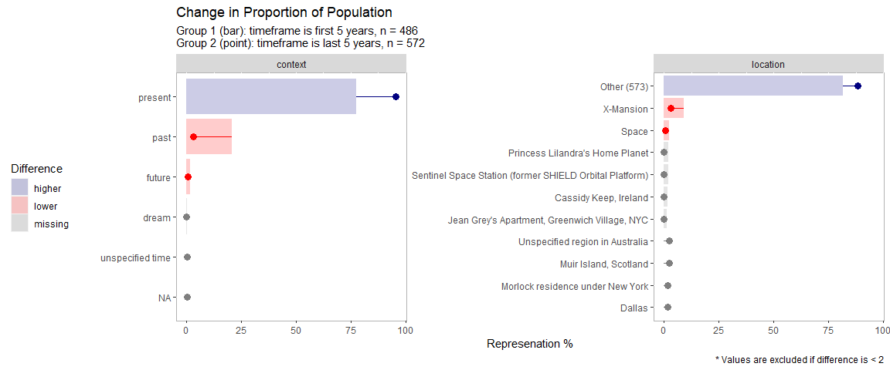
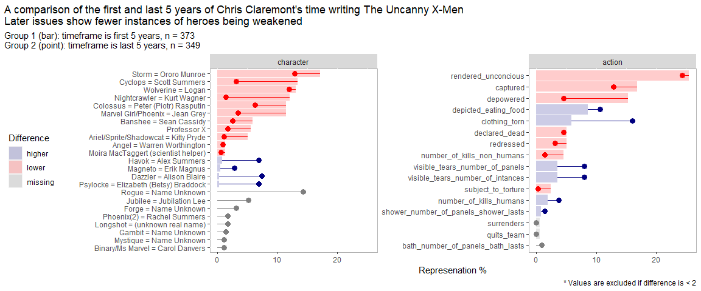

X-Men & Chris Claremont Week 27 2020
================
2020-07-10

## TidyTuesday

``` r
library(tidyverse)
library(tidytuesdayR) # bring in data
library(whereiation) # my R package devtools::install_github("rjake/whereiaton")
```

## Load the weekly Data

``` r
tt <- tt_load("2020-06-30", auth = Sys.getenv("GITHUB_PAT"))
```

    ## 
    ##  Downloading file 1 of 7: `character_visualization.csv`
    ##  Downloading file 2 of 7: `characters.csv`
    ##  Downloading file 3 of 7: `comic_bechdel.csv`
    ##  Downloading file 4 of 7: `covers.csv`
    ##  Downloading file 5 of 7: `issue_collaborators.csv`
    ##  Downloading file 6 of 7: `locations.csv`
    ##  Downloading file 7 of 7: `xmen_bechdel.csv`

# Wrangle

``` r
# select a few of the tables
# filter to first and last 5 years, add column to specify
# select cols with < 20% missing
list_df <- 
  map(
    .x = tt[-(4:5)], 
    .f = 
      ~ filter(., between(issue, 97, 152) | between(issue, 201, 280)) %>% 
      mutate(timeframe = ifelse(issue <= 152, "first 5 years", "last 5 years")) %>% 
      select_if(~mean(is.na(.)) < 0.2) %>% 
      select(-issue)
  )


# write to global env
list_df %>% 
  purrr::walk2(
    .x = names(.),
    .y =  .,
    .f = ~ assign(x = .x, value = .y, envir = globalenv())
  )
```

## Visualize

### More time spent in the present

``` r
locations %>% 
  mutate(context = str_remove_all(tolower(context), "\\*")) %>% 
  whereiation::group_split(
    split_on = "timeframe",
    type = "percent"
  )
```

<!-- -->

### Character’s weakened less often

``` r
characters %>% 
  mutate_if(
    .predicate = ~ mean(. == 0) > 0.5, 
    .funs = ~ ifelse(. > 0, 1, 0)
  ) %>% 
  gather(action, n, -c(timeframe, character)) %>% 
  filter(n > 0) %>%
  whereiation::group_split(
    split_on = "timeframe",
    type = "percent",
    n_cat = NULL
  )  +
  theme(plot.title.position = "plot") +
  labs(
    title = "A comparison of the first and last 5 years of Chris Claremont's time writing The Uncanny X-Men\nLater issues show fewer instances of heroes being weakened"
    )
```

<!-- -->
