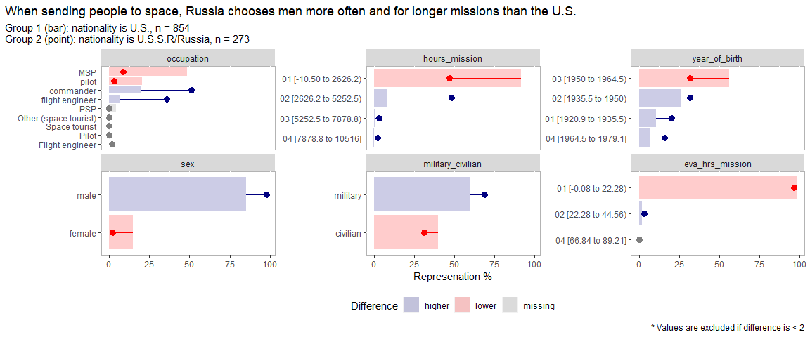

\#TidyTuesday 2020 Week 29 - Astronauts
================
Jake Riley

## TidyTuesday

``` r
library(tidyverse)
library(whereiation) # my R package devtools::install_github("rjake/whereiaton")
```

## Load the weekly data

``` r
astronauts <- 
  read_csv('https://raw.githubusercontent.com/rfordatascience/tidytuesday/master/data/2020/2020-07-14/astronauts.csv')
```

### Compare the US & Russia

``` r
astronauts %>%
  filter(nationality %in% c("U.S.", "U.S.S.R/Russia")) %>%
  select(
    occupation, hours_mission, eva_hrs_mission,
    sex, nationality, military_civilian, year_of_birth
  ) %>% 
  whereiation::group_split(
    split_on = "nationality",
    type = "percent",
    n_quantile = 4
  ) +
  theme(
    plot.title.position = "plot",
    legend.position = "bottom"
  ) +
  labs(
    title = "When sending people to space, Russia chooses men more often and for longer missions than the U.S."
  )
```

<!-- -->
